# 00. Scanner app: visual guide

Start here if you prefer pictures. Each diagram points to the detailed file that explains it. Colours are consistent:

- 🟩 **green** = works and is enforced
- 🟨 **yellow** = partial, manual, or a decision is pending
- 🟥 **red** = defect or risk (see `12-status-gaps-and-roadmap.md` and `11-threat-model-and-security-findings.md`)
- ⬜ **grey** = infrastructure or neutral step

How to view: GitHub, VS Code (Markdown Preview Mermaid Support), or paste a block into https://mermaid.live. A browser version is in `visual-guide.html` (needs internet for the Mermaid library).

Contents: 1 System map · 2 App states · 3 Event-day workflow · 4 Three credentials · 5 Who may call what · 6 Scan decision · 7 QR verification · 8 Admission rules · 9 Couple tickets · 10 Override, deny and manual check-in · 11 Door entry options · 12 Cover wallet charge · 13 Wallet lifecycle · 14 Device lifecycle · 15 Realtime stats · 16 Offline today · 17 New offline design · 18 Offline build status · 19 Defect map · 20 Fix order

---

## 1. System map
Files: `02-app-architecture.md`, `09-backend-api-reference.md`.
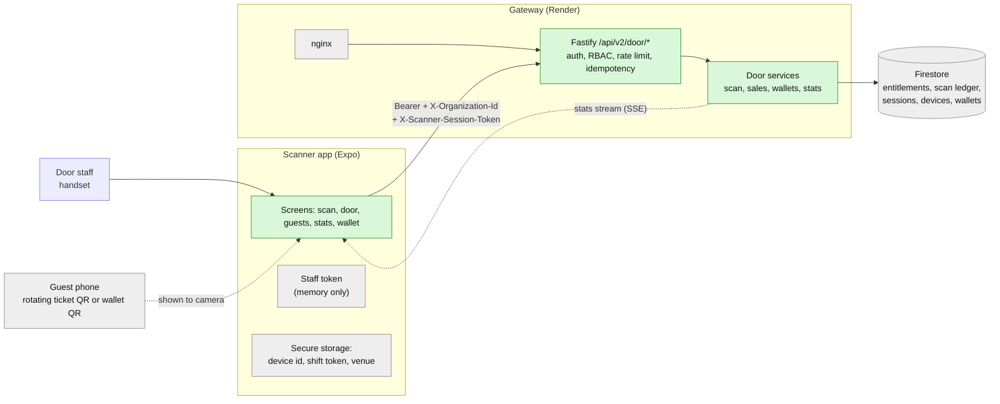
```mermaid
flowchart LR
  ST["Door staff<br/>handset"] --> APP
  subgraph Handset["Scanner app (Expo)"]
    APP["Screens: scan, door, guests, stats, wallet"]
    MEM["Staff token<br/>(memory only)"]
    SEC["Secure storage:<br/>device id, shift token, venue"]
  end
  GUEST["Guest phone<br/>rotating ticket QR or wallet QR"] -.shown to camera.-> APP
  APP -->|"Bearer + X-Organization-Id<br/>+ X-Scanner-Session-Token"| GW
  subgraph Render["Gateway (Render)"]
    NG["nginx"] --> GW["Fastify /api/v2/door/*<br/>auth, RBAC, rate limit, idempotency"]
    GW --> CORE["Door services<br/>scan, sales, wallets, stats"]
  end
  CORE --> FS[("Firestore<br/>entitlements, scan ledger,<br/>sessions, devices, wallets")]
  CORE -.stats stream (SSE).-> APP
  classDef live fill:#d9f7d9,stroke:#2e8b2e,color:#111
  classDef infra fill:#eeeeee,stroke:#888,color:#111
  class APP,GW,CORE live
  class MEM,SEC,NG,FS,GUEST infra
```

## 2. App states: where the user can be
Files: `02-app-architecture.md`.
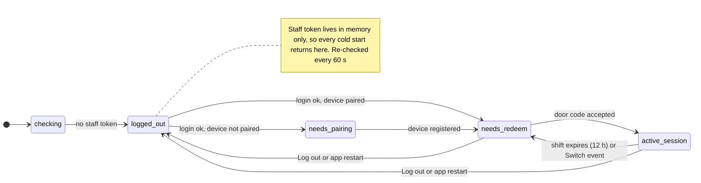
```mermaid
stateDiagram-v2
  direction LR
  [*] --> checking
  checking --> logged_out: no staff token
  logged_out --> needs_pairing: login ok, device not paired
  logged_out --> needs_redeem: login ok, device paired
  needs_pairing --> needs_redeem: device registered
  needs_redeem --> active_session: door code accepted
  active_session --> needs_redeem: shift expires (12 h) or Switch event
  active_session --> logged_out: Log out or app restart
  needs_redeem --> logged_out: Log out or app restart
  note right of logged_out: Staff token lives in memory only, so every cold start returns here. Re-checked every 60 s
```

## 3. Event-day workflow
Files: `01-product-model-and-workflow.md`.
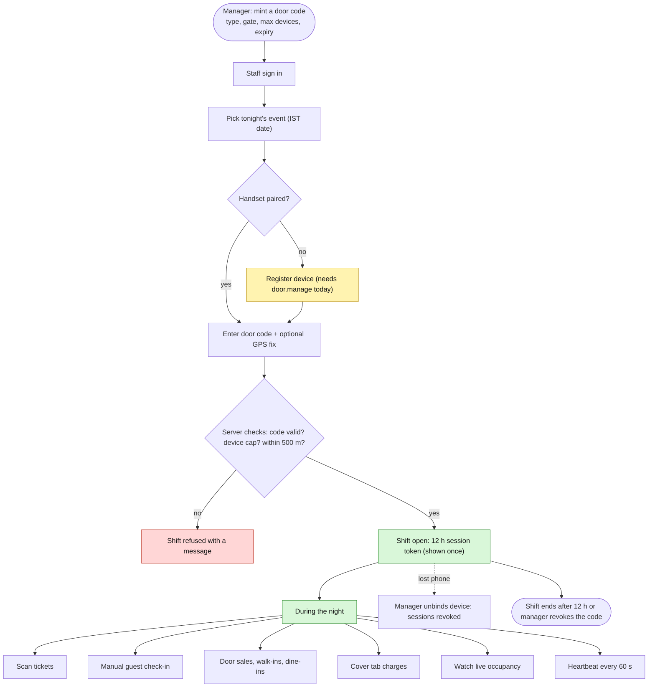
```mermaid
flowchart TD
  M(["Manager: mint a door code<br/>type, gate, max devices, expiry"]) --> S1["Staff sign in"]
  S1 --> S2["Pick tonight's event (IST date)"]
  S2 --> S3{"Handset paired?"}
  S3 -->|no| P["Register device (needs door.manage today)"]
  S3 -->|yes| S4
  P --> S4["Enter door code + optional GPS fix"]
  S4 --> G{"Server checks: code valid? device cap? within 500 m?"}
  G -->|no| E["Shift refused with a message"]
  G -->|yes| SH["Shift open: 12 h session token (shown once)"]
  SH --> W["During the night"]
  W --> A1["Scan tickets"]
  W --> A2["Manual guest check-in"]
  W --> A3["Door sales, walk-ins, dine-ins"]
  W --> A4["Cover tab charges"]
  W --> A5["Watch live occupancy"]
  W --> A6["Heartbeat every 60 s"]
  SH -.lost phone.-> L["Manager unbinds device: sessions revoked"]
  SH --> END(["Shift ends after 12 h or manager revokes the code"])
  classDef ok fill:#d9f7d9,stroke:#2e8b2e,color:#111
  classDef warn fill:#fff3b0,stroke:#b58900,color:#111
  classDef bad fill:#ffd6d6,stroke:#c0392b,color:#111
  class SH,W ok
  class P warn
  class E bad
```
Logout and "end shift" in the app are client-only: the server session stays valid until it expires or is revoked.

## 4. The three credentials
Files: `04-credentials-sessions-devices.md`.
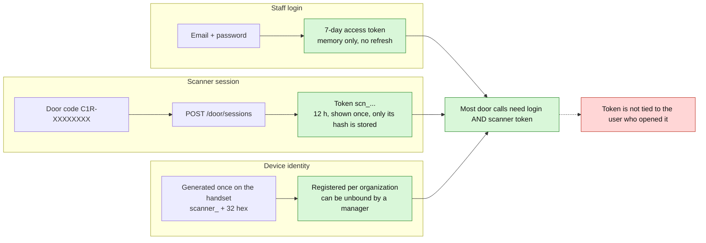
```mermaid
flowchart LR
  subgraph C1["Staff login"]
    A1["Email + password"] --> A2["7-day access token<br/>memory only, no refresh"]
  end
  subgraph C2["Device identity"]
    B1["Generated once on the handset<br/>scanner_ + 32 hex"] --> B2["Registered per organization<br/>can be unbound by a manager"]
  end
  subgraph C3["Scanner session"]
    D1["Door code C1R-XXXXXXXX"] --> D2["POST /door/sessions"] --> D3["Token scn_...<br/>12 h, shown once, only its hash is stored"]
  end
  A2 --> USE["Most door calls need login AND scanner token"]
  D3 --> USE
  B2 --> USE
  USE -.-> W["Token is not tied to the user who opened it"]
  classDef ok fill:#d9f7d9,stroke:#2e8b2e,color:#111
  classDef bad fill:#ffd6d6,stroke:#c0392b,color:#111
  class A2,B2,D3,USE ok
  class W bad
```

## 5. Who may call what
Files: `04-credentials-sessions-devices.md`, `09-backend-api-reference.md`.
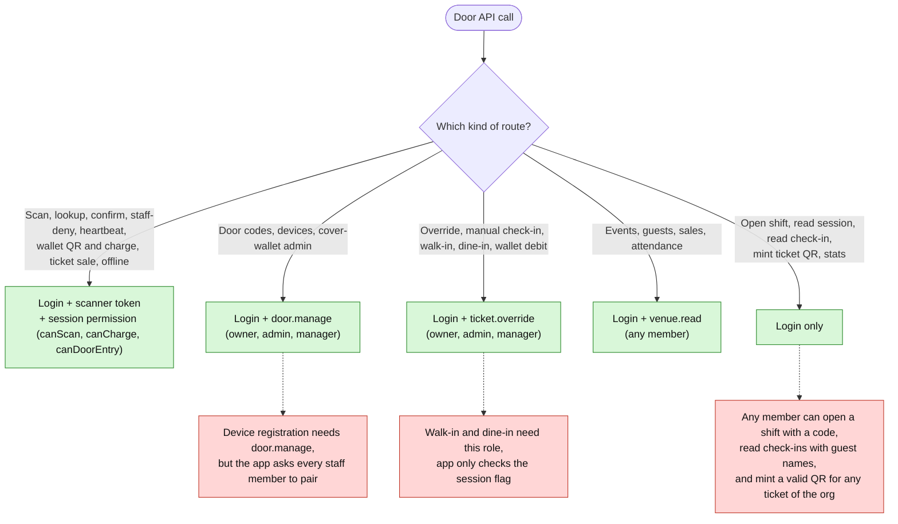
```mermaid
flowchart TD
  R(["Door API call"]) --> Q{"Which kind of route?"}
  Q -->|"Scan, lookup, confirm, staff-deny, heartbeat,<br/>wallet QR and charge, ticket sale, offline"| T1["Login + scanner token<br/>+ session permission (canScan, canCharge, canDoorEntry)"]
  Q -->|"Door codes, devices, cover-wallet admin"| T2["Login + door.manage<br/>(owner, admin, manager)"]
  Q -->|"Override, manual check-in, walk-in, dine-in, wallet debit"| T3["Login + ticket.override<br/>(owner, admin, manager)"]
  Q -->|"Events, guests, sales, attendance"| T4["Login + venue.read<br/>(any member)"]
  Q -->|"Open shift, read session, read check-in,<br/>mint ticket QR, stats"| T5["Login only"]
  T5 -.-> RISK["Any member can open a shift with a code,<br/>read check-ins with guest names,<br/>and mint a valid QR for any ticket of the org"]
  T2 -.-> R2["Device registration needs door.manage,<br/>but the app asks every staff member to pair"]
  T3 -.-> R3["Walk-in and dine-in need this role,<br/>app only checks the session flag"]
  classDef ok fill:#d9f7d9,stroke:#2e8b2e,color:#111
  classDef bad fill:#ffd6d6,stroke:#c0392b,color:#111
  class T1,T2,T3,T4 ok
  class T5 ok
  class RISK,R2,R3 bad
```

## 6. What happens when a guest is scanned (online)
Files: `03-screens-and-scan-flow.md`.
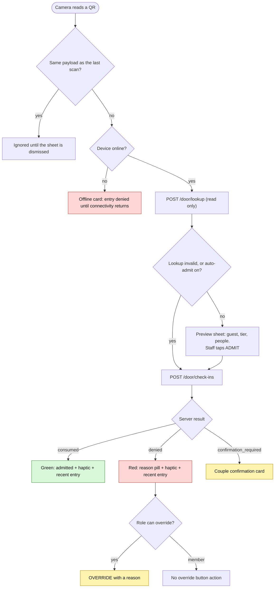
```mermaid
flowchart TD
  C(["Camera reads a QR"]) --> D{"Same payload as the last scan?"}
  D -->|yes| IGN["Ignored until the sheet is dismissed"]
  D -->|no| N{"Device online?"}
  N -->|no| OFF["Offline card: entry denied until connectivity returns"]
  N -->|yes| LK["POST /door/lookup (read only)"]
  LK --> AA{"Lookup invalid, or auto-admit on?"}
  AA -->|yes| CI["POST /door/check-ins"]
  AA -->|no| PV["Preview sheet: guest, tier, people.<br/>Staff taps ADMIT"]
  PV --> CI
  CI --> R{"Server result"}
  R -->|consumed| OK["Green: admitted + haptic + recent entry"]
  R -->|denied| NO["Red: reason pill + haptic + recent entry"]
  R -->|confirmation_required| CP["Couple confirmation card"]
  NO --> OV{"Role can override?"}
  OV -->|yes| OVR["OVERRIDE with a reason"]
  OV -->|"member"| STOP["No override button action"]
  classDef ok fill:#d9f7d9,stroke:#2e8b2e,color:#111
  classDef bad fill:#ffd6d6,stroke:#c0392b,color:#111
  classDef warn fill:#fff3b0,stroke:#b58900,color:#111
  class OK ok
  class NO,OFF bad
  class CP,OVR warn
```
A timeout is 60 s by default, so a bad network can hold the screen for up to a minute before the offline card appears.

## 7. How the server checks a QR (and the hole)
Files: `05-qr-and-admission.md`.
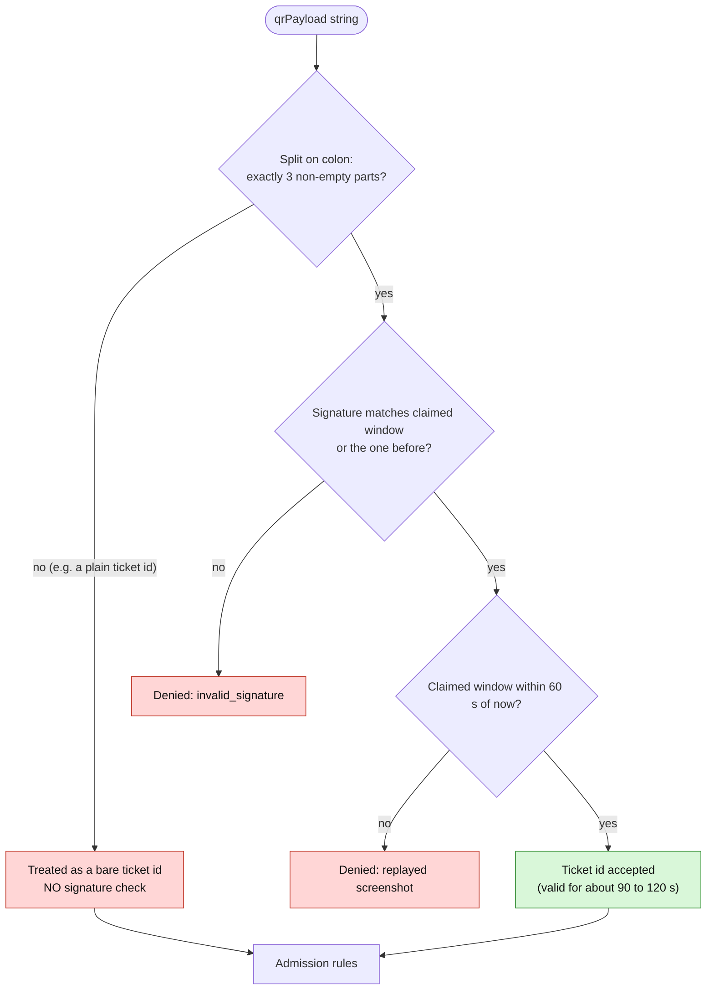
```mermaid
flowchart TD
  P(["qrPayload string"]) --> S{"Split on colon:<br/>exactly 3 non-empty parts?"}
  S -->|"no (e.g. a plain ticket id)"| BARE["Treated as a bare ticket id<br/>NO signature check"]
  S -->|yes| SIG{"Signature matches claimed window<br/>or the one before?"}
  SIG -->|no| DEN1["Denied: invalid_signature"]
  SIG -->|yes| WIN{"Claimed window within 60 s of now?"}
  WIN -->|no| DEN2["Denied: replayed screenshot"]
  WIN -->|yes| OKQ["Ticket id accepted<br/>(valid for about 90 to 120 s)"]
  BARE --> ADM["Admission rules"]
  OKQ --> ADM
  classDef ok fill:#d9f7d9,stroke:#2e8b2e,color:#111
  classDef bad fill:#ffd6d6,stroke:#c0392b,color:#111
  class OKQ ok
  class BARE bad
  class DEN1,DEN2 bad
```
Anyone who knows or sees a ticket id (the holder's own wallet screens expose it) can present it without the rotating code. The docs say bare ids are never accepted; the code accepts them.

## 8. Admission rules, in order
Files: `05-qr-and-admission.md`.
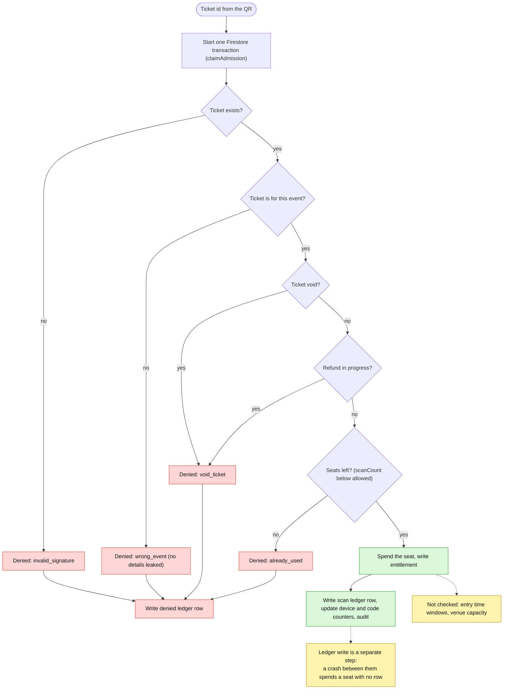
```mermaid
flowchart TD
  A(["Ticket id from the QR"]) --> T["Start one Firestore transaction (claimAdmission)"]
  T --> E1{"Ticket exists?"}
  E1 -->|no| X1["Denied: invalid_signature"]
  E1 -->|yes| E2{"Ticket is for this event?"}
  E2 -->|no| X2["Denied: wrong_event (no details leaked)"]
  E2 -->|yes| E3{"Ticket void?"}
  E3 -->|yes| X3["Denied: void_ticket"]
  E3 -->|no| E4{"Refund in progress?"}
  E4 -->|yes| X3
  E4 -->|no| E5{"Seats left? (scanCount below allowed)"}
  E5 -->|no| X4["Denied: already_used"]
  E5 -->|yes| OKK["Spend the seat, write entitlement"]
  OKK --> L["Write scan ledger row, update device and code counters, audit"]
  X1 --> L2["Write denied ledger row"]
  X2 --> L2
  X3 --> L2
  X4 --> L2
  L -.-> GAP1["Ledger write is a separate step:<br/>a crash between them spends a seat with no row"]
  OKK -.-> GAP2["Not checked: entry time windows, venue capacity"]
  classDef ok fill:#d9f7d9,stroke:#2e8b2e,color:#111
  classDef bad fill:#ffd6d6,stroke:#c0392b,color:#111
  classDef warn fill:#fff3b0,stroke:#b58900,color:#111
  class OKK,L ok
  class X1,X2,X3,X4,L2 bad
  class GAP1,GAP2 warn
```

## 9. Couple tickets (two seats, two steps)
Files: `03-screens-and-scan-flow.md`, `05-qr-and-admission.md`.
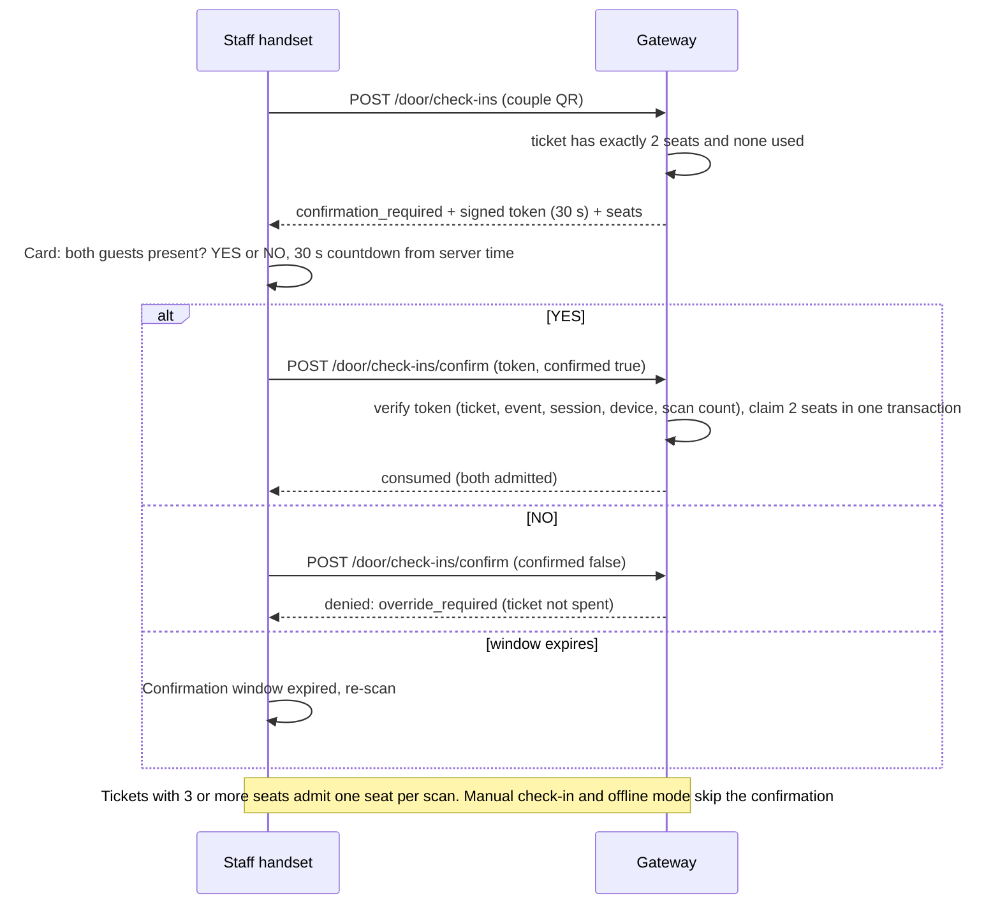
```mermaid
sequenceDiagram
  participant S as Staff handset
  participant G as Gateway
  S->>G: POST /door/check-ins (couple QR)
  G->>G: ticket has exactly 2 seats and none used
  G-->>S: confirmation_required + signed token (30 s) + seats
  S->>S: Card: both guests present? YES or NO, 30 s countdown from server time
  alt YES
    S->>G: POST /door/check-ins/confirm (token, confirmed true)
    G->>G: verify token (ticket, event, session, device, scan count), claim 2 seats in one transaction
    G-->>S: consumed (both admitted)
  else NO
    S->>G: POST /door/check-ins/confirm (confirmed false)
    G-->>S: denied: override_required (ticket not spent)
  else window expires
    S->>S: Confirmation window expired, re-scan
  end
  Note over S,G: Tickets with 3 or more seats admit one seat per scan. Manual check-in and offline mode skip the confirmation
```

## 10. Override, staff-deny and manual check-in
Files: `05-qr-and-admission.md`.
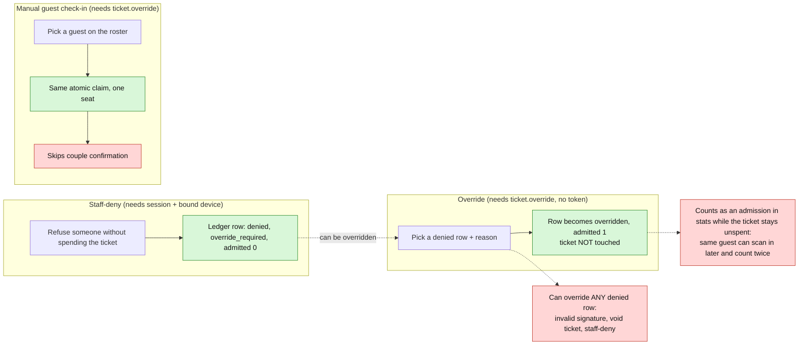
```mermaid
flowchart LR
  subgraph DENY["Staff-deny (needs session + bound device)"]
    D1["Refuse someone without spending the ticket"] --> D2["Ledger row: denied, override_required, admitted 0"]
  end
  subgraph OVR["Override (needs ticket.override, no token)"]
    O1["Pick a denied row + reason"] --> O2["Row becomes overridden, admitted 1<br/>ticket NOT touched"]
  end
  subgraph MAN["Manual guest check-in (needs ticket.override)"]
    M1["Pick a guest on the roster"] --> M2["Same atomic claim, one seat"]
    M2 --> M3["Skips couple confirmation"]
  end
  D2 -.can be overridden.-> O1
  O2 -.-> W1["Counts as an admission in stats while the ticket stays unspent:<br/>same guest can scan in later and count twice"]
  O1 -.-> W2["Can override ANY denied row:<br/>invalid signature, void ticket, staff-deny"]
  classDef ok fill:#d9f7d9,stroke:#2e8b2e,color:#111
  classDef bad fill:#ffd6d6,stroke:#c0392b,color:#111
  class D2,O2,M2 ok
  class W1,W2,M3 bad
```

## 11. Door entry: three ways to let someone in
Files: `06-door-sales-and-cover-wallet.md`.
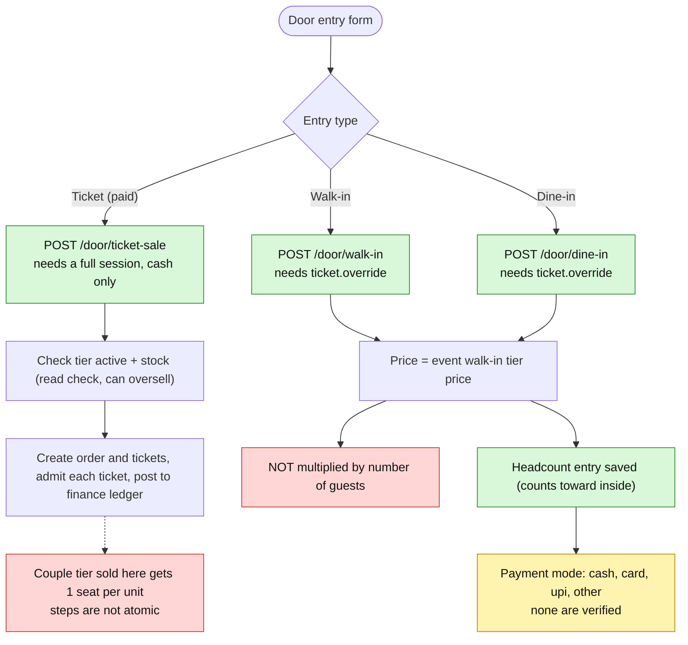
```mermaid
flowchart TD
  F(["Door entry form"]) --> T{"Entry type"}
  T -->|"Ticket (paid)"| TS["POST /door/ticket-sale<br/>needs a full session, cash only"]
  T -->|Walk-in| WI["POST /door/walk-in<br/>needs ticket.override"]
  T -->|Dine-in| DI["POST /door/dine-in<br/>needs ticket.override"]
  TS --> TS1["Check tier active + stock (read check, can oversell)"]
  TS1 --> TS2["Create order and tickets, admit each ticket, post to finance ledger"]
  TS2 -.-> TSW["Couple tier sold here gets 1 seat per unit<br/>steps are not atomic"]
  WI --> PR["Price = event walk-in tier price"]
  DI --> PR
  PR --> PRW["NOT multiplied by number of guests"]
  PR --> HC["Headcount entry saved (counts toward inside)"]
  HC --> PAY["Payment mode: cash, card, upi, other<br/>none are verified"]
  classDef ok fill:#d9f7d9,stroke:#2e8b2e,color:#111
  classDef bad fill:#ffd6d6,stroke:#c0392b,color:#111
  classDef warn fill:#fff3b0,stroke:#b58900,color:#111
  class TS,WI,DI,HC ok
  class TSW,PRW bad
  class PAY warn
```

## 12. Cover wallet charge
Files: `06-door-sales-and-cover-wallet.md`.
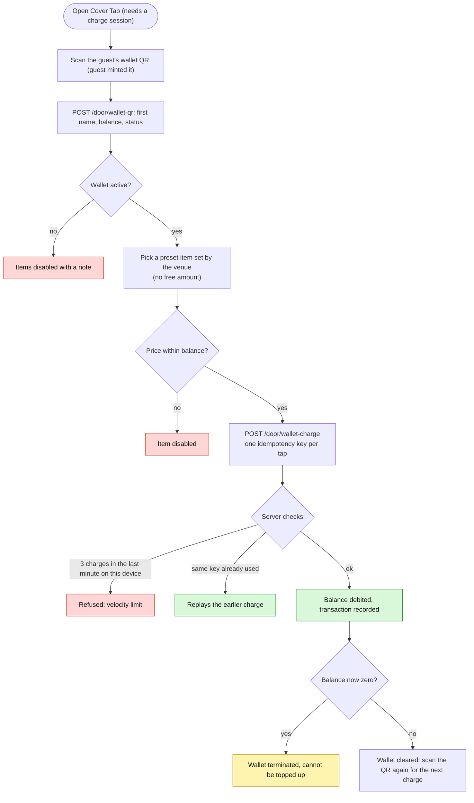
```mermaid
flowchart TD
  S(["Open Cover Tab (needs a charge session)"]) --> SC["Scan the guest's wallet QR (guest minted it)"]
  SC --> RV["POST /door/wallet-qr: first name, balance, status"]
  RV --> ST{"Wallet active?"}
  ST -->|no| BLK["Items disabled with a note"]
  ST -->|yes| IT["Pick a preset item set by the venue<br/>(no free amount)"]
  IT --> AF{"Price within balance?"}
  AF -->|no| DIS["Item disabled"]
  AF -->|yes| CH["POST /door/wallet-charge<br/>one idempotency key per tap"]
  CH --> V{"Server checks"}
  V -->|"3 charges in the last minute on this device"| VEL["Refused: velocity limit"]
  V -->|"same key already used"| REP["Replays the earlier charge"]
  V -->|ok| DONE["Balance debited, transaction recorded"]
  DONE --> Z{"Balance now zero?"}
  Z -->|yes| TERM["Wallet terminated, cannot be topped up"]
  Z -->|no| NEXT["Wallet cleared: scan the QR again for the next charge"]
  classDef ok fill:#d9f7d9,stroke:#2e8b2e,color:#111
  classDef bad fill:#ffd6d6,stroke:#c0392b,color:#111
  classDef warn fill:#fff3b0,stroke:#b58900,color:#111
  class DONE,REP ok
  class VEL,BLK,DIS bad
  class TERM warn
```

## 13. Wallet lifecycle
Files: `06-door-sales-and-cover-wallet.md`, `10-domain-model-and-state-machines.md`.
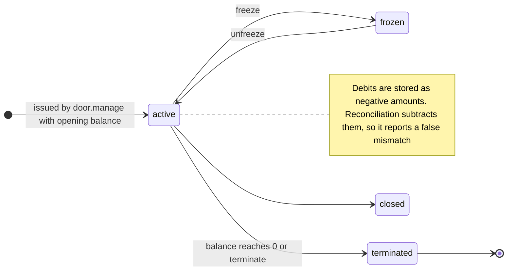
```mermaid
stateDiagram-v2
  direction LR
  [*] --> active: issued by door.manage with opening balance
  active --> frozen: freeze
  frozen --> active: unfreeze
  active --> terminated: balance reaches 0 or terminate
  active --> closed
  terminated --> [*]
  note right of active: Debits are stored as negative amounts. Reconciliation subtracts them, so it reports a false mismatch
```

## 14. Device lifecycle and the lost phone
Files: `04-credentials-sessions-devices.md`.
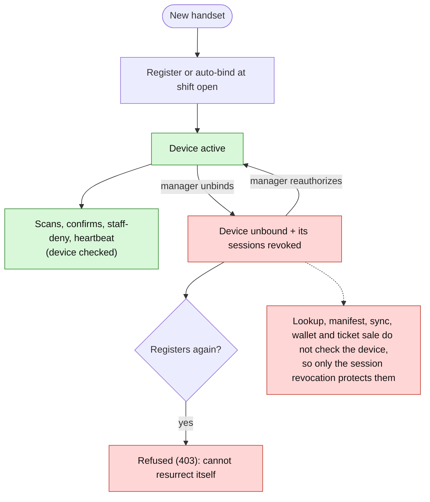
```mermaid
flowchart TD
  N(["New handset"]) --> R["Register or auto-bind at shift open"]
  R --> ACT["Device active"]
  ACT --> SC["Scans, confirms, staff-deny, heartbeat<br/>(device checked)"]
  ACT -->|"manager unbinds"| UB["Device unbound + its sessions revoked"]
  UB --> TRY{"Registers again?"}
  TRY -->|yes| REF["Refused (403): cannot resurrect itself"]
  UB -->|"manager reauthorizes"| ACT
  UB -.-> GAP["Lookup, manifest, sync, wallet and ticket sale do not check the device,<br/>so only the session revocation protects them"]
  classDef ok fill:#d9f7d9,stroke:#2e8b2e,color:#111
  classDef bad fill:#ffd6d6,stroke:#c0392b,color:#111
  class ACT,SC ok
  class UB,REF bad
  class GAP bad
```

## 15. Live occupancy path
Files: `07-stats-guests-and-realtime.md`.
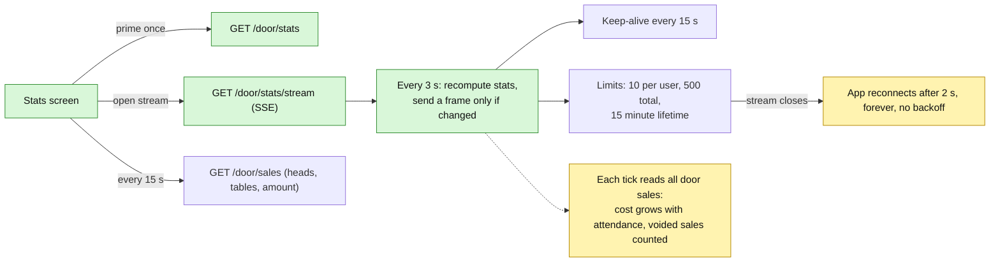
```mermaid
flowchart LR
  APP["Stats screen"] -->|"prime once"| ST["GET /door/stats"]
  APP -->|"open stream"| SSE["GET /door/stats/stream (SSE)"]
  SSE --> TICK["Every 3 s: recompute stats,<br/>send a frame only if changed"]
  TICK --> KA["Keep-alive every 15 s"]
  TICK --> LIM["Limits: 10 per user, 500 total,<br/>15 minute lifetime"]
  LIM -->|"stream closes"| RE["App reconnects after 2 s, forever, no backoff"]
  APP -->|"every 15 s"| SALES["GET /door/sales (heads, tables, amount)"]
  TICK -.-> COST["Each tick reads all door sales:<br/>cost grows with attendance, voided sales counted"]
  classDef ok fill:#d9f7d9,stroke:#2e8b2e,color:#111
  classDef warn fill:#fff3b0,stroke:#b58900,color:#111
  class APP,ST,SSE,TICK ok
  class RE,COST warn
```
The stats routes need no scanner token, so the app sending only the organization header is correct.

## 16. Offline today: the app fails closed
Files: `08-offline-design-and-status.md`.
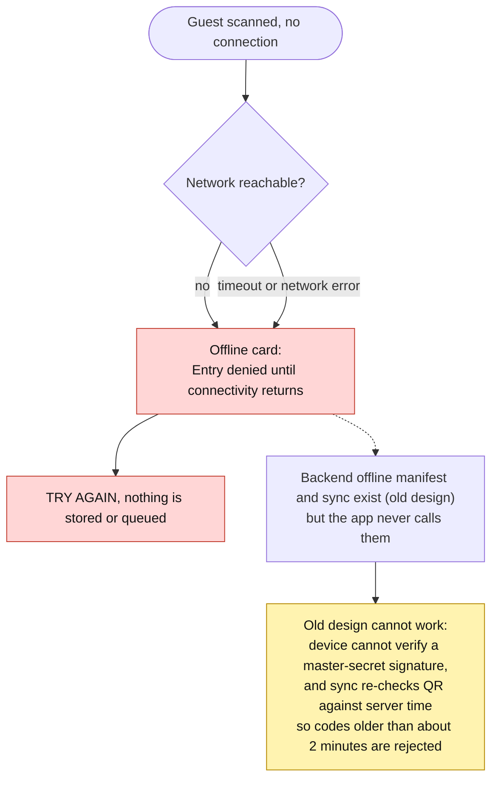
```mermaid
flowchart TD
  S(["Guest scanned, no connection"]) --> N{"Network reachable?"}
  N -->|no| C["Offline card:<br/>Entry denied until connectivity returns"]
  N -->|"timeout or network error"| C
  C --> T["TRY AGAIN, nothing is stored or queued"]
  C -.-> WHY["Backend offline manifest and sync exist (old design)<br/>but the app never calls them"]
  WHY --> OLD["Old design cannot work:<br/>device cannot verify a master-secret signature,<br/>and sync re-checks QR against server time<br/>so codes older than about 2 minutes are rejected"]
  classDef bad fill:#ffd6d6,stroke:#c0392b,color:#111
  classDef warn fill:#fff3b0,stroke:#b58900,color:#111
  class C,T bad
  class OLD warn
```

## 17. New offline design (backend merged on staging, app not wired)
Files: `08-offline-design-and-status.md`.
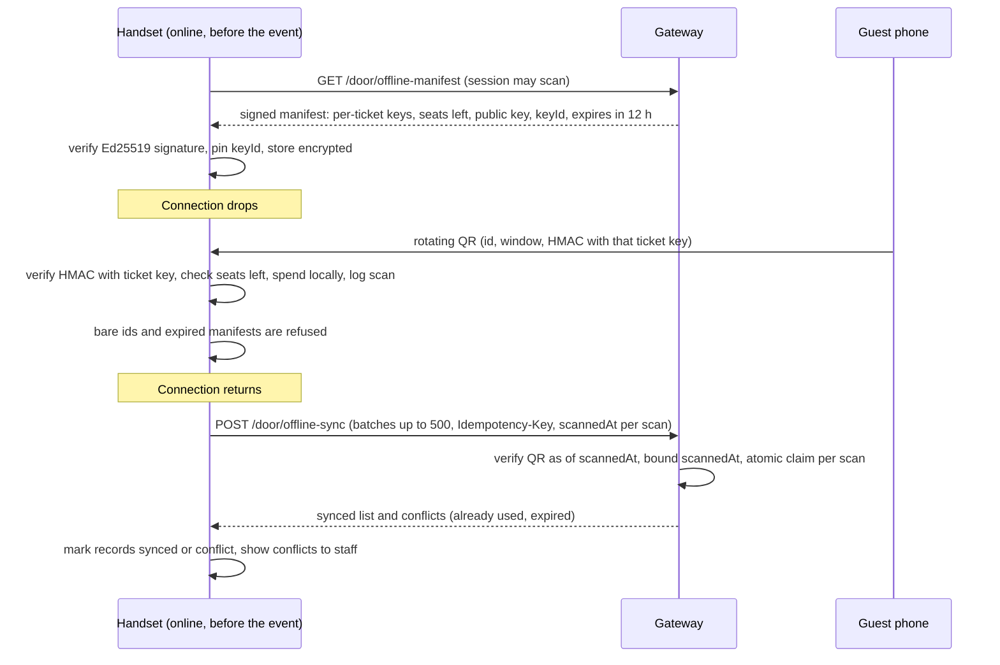
```mermaid
sequenceDiagram
  participant D as Handset (online, before the event)
  participant G as Gateway
  participant X as Guest phone
  D->>G: GET /door/offline-manifest (session may scan)
  G-->>D: signed manifest: per-ticket keys, seats left, public key, keyId, expires in 12 h
  D->>D: verify Ed25519 signature, pin keyId, store encrypted
  Note over D: Connection drops
  X->>D: rotating QR (id, window, HMAC with that ticket key)
  D->>D: verify HMAC with ticket key, check seats left, spend locally, log scan
  D->>D: bare ids and expired manifests are refused
  Note over D: Connection returns
  D->>G: POST /door/offline-sync (batches up to 500, Idempotency-Key, scannedAt per scan)
  G->>G: verify QR as of scannedAt, bound scannedAt, atomic claim per scan
  G-->>D: synced list and conflicts (already used, expired)
  D->>D: mark records synced or conflict, show conflicts to staff
```

## 18. Offline: what is built and where
Files: `08-offline-design-and-status.md`.
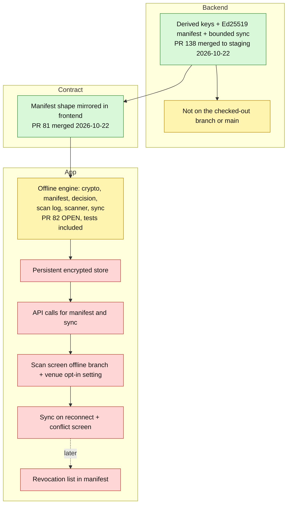
```mermaid
flowchart TD
  subgraph BE["Backend"]
    B1["Derived keys + Ed25519 manifest + bounded sync<br/>PR 138 merged to staging 2026-10-22"]
    B2["Not on the checked-out branch or main"]
  end
  subgraph CT["Contract"]
    C1["Manifest shape mirrored in frontend<br/>PR 81 merged 2026-10-22"]
  end
  subgraph FE["App"]
    F1["Offline engine: crypto, manifest, decision,<br/>scan log, scanner, sync<br/>PR 82 OPEN, tests included"]
    F2["Persistent encrypted store"]
    F3["API calls for manifest and sync"]
    F4["Scan screen offline branch + venue opt-in setting"]
    F5["Sync on reconnect + conflict screen"]
    F6["Revocation list in manifest"]
  end
  B1 --> B2
  B1 --> C1 --> F1
  F1 --> F2 --> F3 --> F4 --> F5
  F5 -.later.-> F6
  classDef ok fill:#d9f7d9,stroke:#2e8b2e,color:#111
  classDef warn fill:#fff3b0,stroke:#b58900,color:#111
  classDef bad fill:#ffd6d6,stroke:#c0392b,color:#111
  class B1,C1 ok
  class F1,B2 warn
  class F2,F3,F4,F5,F6 bad
```

## 19. Defect map
Files: `12-status-gaps-and-roadmap.md`, `11-threat-model-and-security-findings.md`.

```mermaid
flowchart TD
  ROOT(["Scanner risks"]) --> ENT["Entry integrity"]
  ROOT --> ACC["Access control"]
  ROOT --> MON["Door money"]
  ROOT --> APPQ["App quality"]
  ROOT --> OFF["Offline"]
  ENT --> e1["Bare ticket id accepted without signature"]
  ENT --> e2["QR valid 90 to 120 s, not 30 s"]
  ENT --> e3["Override can admit any denied row, can double count"]
  ENT --> e4["Ledger write not atomic with seat spend"]
  ACC --> a1["Device registration needs door.manage:<br/>member staff cannot pair"]
  ACC --> a2["Any member can read check-ins and mint QRs"]
  ACC --> a3["Scanner token not tied to the user"]
  ACC --> a4["Idempotency keys global across tenants"]
  MON --> m1["Walk-in price ignores party size"]
  MON --> m2["Wallet reconciliation sign bug"]
  MON --> m3["Door ticket sale can oversell, couple tier gets 1 seat"]
  MON --> m4["Card and UPI accepted without verification"]
  APPQ --> q1["No tests, no native build pipeline"]
  APPQ --> q2["Logout does not revoke server session"]
  APPQ --> q3["Cold start forces re-login"]
  APPQ --> q4["60 s timeout, decorative settings, sparse accessibility"]
  OFF --> o1["Required by the business but not wired"]
  OFF --> o2["No revocation, double admission across gates"]
  classDef bad fill:#ffd6d6,stroke:#c0392b,color:#111
  classDef warn fill:#fff3b0,stroke:#b58900,color:#111
  class e1,e3,a1,a2,m2,o1 bad
  class e2,e4,a3,a4,m1,m3,m4,q1,q2,q3,q4,o2 warn
```

## 20. Suggested fix order
Files: `12-status-gaps-and-roadmap.md`.

```mermaid
flowchart LR
  F1["Step 1: Decide offline model (ADR),<br/>wire PR 82"] --> F2["Step 2: Remove bare-id acceptance,<br/>tighten QR window"]
  F2 --> F3["Step 3: Fix door permissions<br/>and read access"]
  F3 --> F4["Step 4: Bind token to user,<br/>enforce device binding, cap session life"]
  F4 --> F5["Step 5: Money fixes: pricing, verification,<br/>tenant-scoped keys, reconciliation sign"]
  F5 --> F6["Step 6: App: server logout, token refresh,<br/>tests, native pipeline, device E2E"]
  F6 --> F7["Step 7: Stats aggregates and caching"]
  F7 --> F8["Step 8: Refresh stale docs"]
  classDef step fill:#e8f0fe,stroke:#4a6fa5,color:#111
  class F1,F2,F3,F4,F5,F6,F7,F8 step
```
